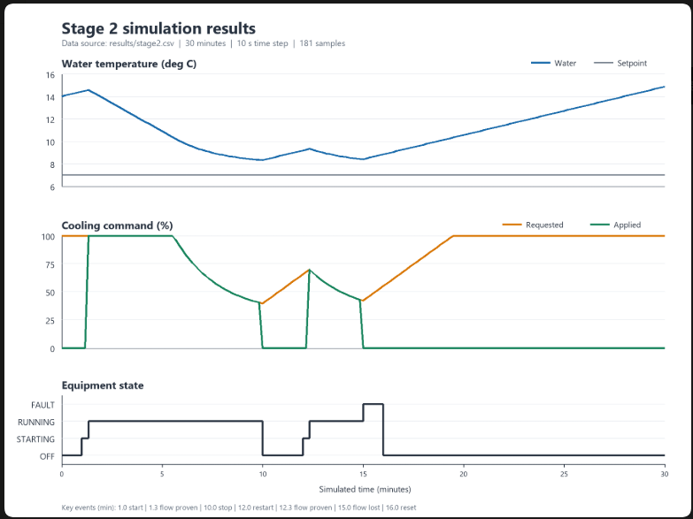
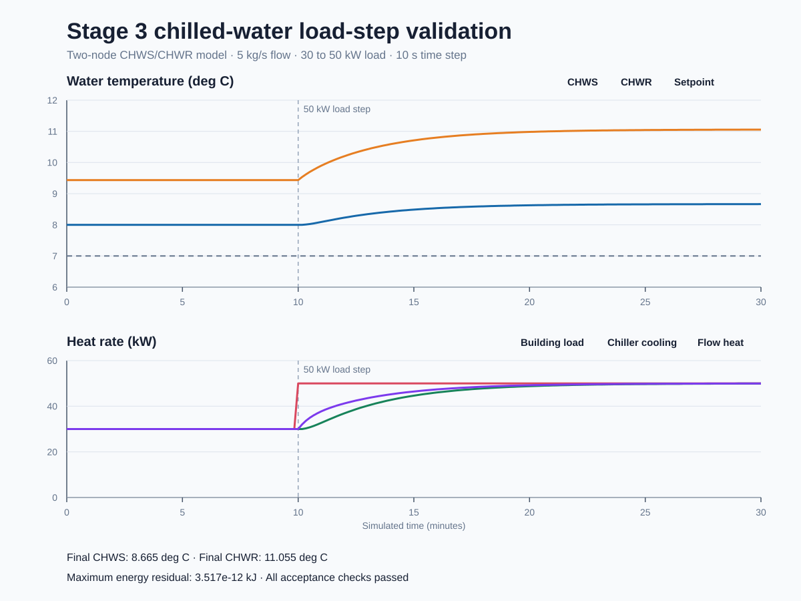
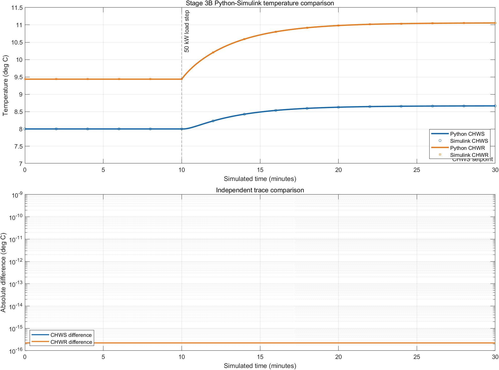
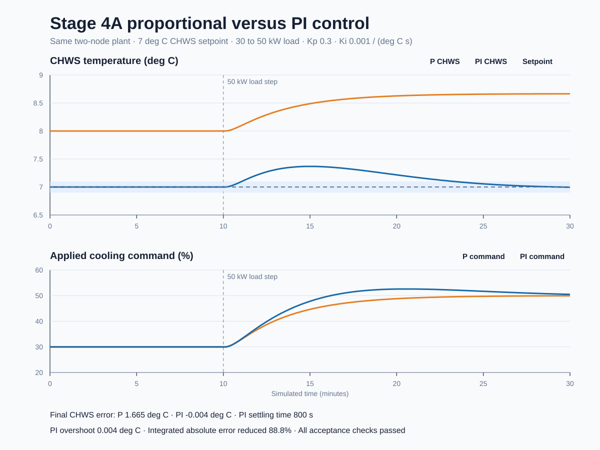
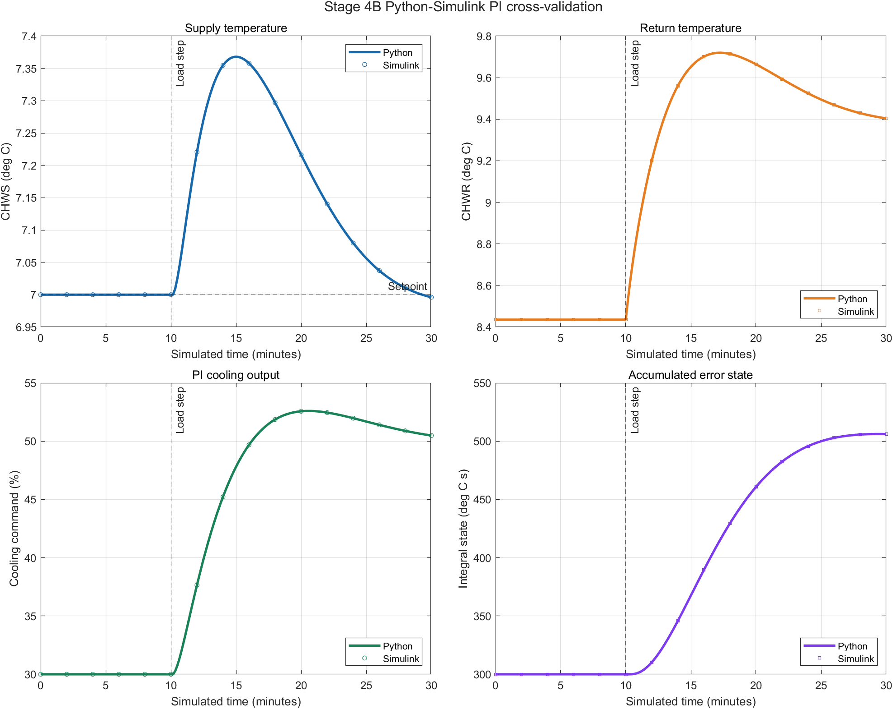

# Chiller Control Simulator

An educational Python and Simulink project for learning controls software
engineering through a simplified chilled-water system.

Stage 1 established a lumped water-temperature model and proportional control.
Stage 2 added a tested equipment operating sequence with OFF, STARTING,
RUNNING, and FAULT states. Stage 3 adds separate chilled-water supply and
return temperatures, mass-flow heat transfer, a defined load-step experiment,
and quantitative physics validation. Stage 3B recreates that experiment in
Simulink and compares every temperature sample with the Python reference.
Stage 4A compares proportional and PI control against explicit setpoint-response,
control-output, energy-conservation, and numerical-sensitivity criteria. Stage
4B recreates the PI case in Simulink and compares its temperature, command, and
integral-state samples with Python.

This is an independent learning simulation. It is not connected to physical equipment and does not represent any manufacturer's control software.

## Run the simulation

The Python model uses only the standard library and has been tested with Python
3.12.13. Stage 3B was developed for MATLAB R2024a with Simulink.

From the project root:

```powershell
python main.py
```

The program calculates 30 minutes of operation using 10-second simulation steps. It does not wait for 30 minutes of real time. Results are written to `results/stage2.csv`; the existing Stage 1 result remains separate.

Run all tests with:

```powershell
python -m unittest discover -s tests -v
```

Run the Stage 3 load-step experiment and regenerate its plot with:

```powershell
python stage3_main.py
python plot_stage3.py
```

The Stage 3 runner writes `results/stage3.csv`. The plotting script reads that
CSV and writes `docs/stage3-load-step-results.svg` using only the Python
standard library.

From MATLAB, rebuild and validate the Stage 3B model with:

```matlab
addpath("matlab")
build_stage3b_model
run_stage3b_validation
```

The validation script compares all 181 Simulink samples with the Python CSV,
checks the `1e-9 degC` acceptance limit, and generates comparison evidence.

Run the Stage 4A controller comparison and regenerate its plot with:

```powershell
python stage4_main.py
python plot_stage4.py
```

The runner writes aligned P and PI samples to `results/stage4.csv` and compact
metrics to `results/stage4_summary.csv`. The plotting script creates
`docs/stage4-p-vs-pi-results.svg` using only the Python standard library.

From MATLAB, rebuild and validate the Stage 4B PI model with:

```matlab
addpath("matlab")
build_stage4b_model
run_stage4b_validation
```

The script compares all 181 PI samples for CHWS, CHWR, cooling fraction, and
integral state. Each maximum absolute difference must be no greater than
`1e-9` in the signal's native units.

## Demonstration scenario

The scenario is deterministic so every state transition can be reproduced and tested.

| Simulated time | Input event | Resulting state | Cooling permission |
| ---: | --- | --- | --- |
| 0 s | Initial condition | OFF | Blocked |
| 60 s | Start command | STARTING | Blocked |
| 80 s | Flow proven | RUNNING | Permitted |
| 600 s | Normal stop command | OFF | Blocked |
| 720 s | Second start command | STARTING | Blocked |
| 740 s | Flow proven | RUNNING | Permitted |
| 900 s | Flow lost while running | FAULT | Blocked |
| 950 s | Flow restored | FAULT remains latched | Blocked |
| 960 s | Reset with flow restored | OFF | Blocked |

The water begins at 14 degrees Celsius with a constant 30 kW heat load. It warms while cooling is blocked, cools while the equipment is RUNNING, and warms again after the fault and reset. The default run ends in OFF at approximately 14.862 degrees Celsius.

## Stage 2 result



The upper plot shows the water-temperature response. The middle plot compares
requested cooling with the cooling permitted by the equipment state. The lower
plot records the OFF, STARTING, RUNNING, and FAULT sequence. The plotted data is
preserved in `results/stage2.csv`; `results/stage1.csv` retains the Stage 1
baseline.

## Stage 3 result



Stage 3 starts from the analytical steady state for a 30 kW building load,
then increases the load to 50 kW at 10 simulated minutes. The final simulated
CHWS temperature is 8.665 degC versus an analytical value of 8.667 degC. The
final CHWR temperature is 11.055 degC versus an analytical value of 11.059
degC. The maximum energy-conservation residual is approximately
`3.5e-12 kJ`; changing the time step from 10 s to 5 s changes the final
temperature by approximately `0.0003 degC`.

The experiment therefore passes its analytical-temperature, total-energy, and
time-step-sensitivity acceptance criteria. Its assumptions and derivation are
recorded in [Stage 3 Engineering Basis](docs/STAGE3_ENGINEERING_BASIS.md).
The [Stage 3 Tool Guide](docs/STAGE3_TOOL_GUIDE.md) explains how to run and
inspect the Python program, tests, CSV data, SVG plot, and Git evidence.

## Stage 3B result



The Simulink model uses `Unit Delay`, `Step`, `Sum`, `Gain`, `Saturation`, and
`To Workspace` blocks to reproduce the same discrete energy balances and
proportional controller as Python. The automated validation compares every
CHWS and CHWR sample and fails if either maximum absolute difference exceeds
`1e-9 degC`.

The model structure, acceptance criterion, evidence outputs, and limitations
are recorded in [Stage 3B Cross-Validation](docs/STAGE3B_CROSS_VALIDATION.md).
The [Stage 3B Tool Guide](docs/STAGE3B_TOOL_GUIDE.md) explains how to open,
run, inspect, and rebuild the Simulink model.

## Stage 4A result



Both controllers use the same Stage 3 plant, 7 degC CHWS setpoint, and 30 to
50 kW load step. P finishes with a 1.665 degC CHWS error. PI finishes with a
-0.004 degC error, enters and remains within the +/-0.1 degC band after 800 s,
and limits overshoot to 0.004 degC. Its integrated absolute error is 88.8%
lower than P for the defined post-step period.

All cooling commands remain between 0% and 100%, maximum energy residual stays
below `3.6e-12 kJ`, and changing the PI time step from 10 s to 5 s changes final
CHWS by about `0.0017 degC`. The PI controller includes conditional anti-windup,
which is exercised by dedicated saturation tests.

The equations, initial-condition decision, metrics, criteria, results, and
limitations are recorded in [Stage 4A Engineering Basis](docs/STAGE4_ENGINEERING_BASIS.md).
The [Stage 4A Tool Guide](docs/STAGE4_TOOL_GUIDE.md) explains how to run and
inspect the Python evidence.

## Stage 4B result



The generated Simulink model uses standard `Sum`, `Gain`, `Unit Delay`,
`Saturation`, `Step`, and `To Workspace` blocks. It reproduces the Stage 4A PI
controller timing and the Stage 3 two-node plant at a 10-second sample time.

The automated validation aligns 181 samples and checks CHWS, CHWR, applied
cooling fraction, and integral state. The measured maximum differences and
pass/fail result are preserved in `results/stage4b_summary.csv`.

The defined load step never saturates the controller, so this cross-tool result
covers normal PI operation. Conditional anti-windup remains verified by the
Stage 4A Python saturation tests. The evidence boundary and limitations are in
[Stage 4B Cross-Validation](docs/STAGE4B_CROSS_VALIDATION.md); operating steps
are in [Stage 4B Tool Guide](docs/STAGE4B_TOOL_GUIDE.md).

## Control sequence

```text
temperature + setpoint
        |
        v
proportional_control() ------> requested cooling
                                      |
commands + flow + timer               |
        |                             |
        v                             v
update_equipment_state() ---> apply_cooling_permission()
        |                             |
        v                             v
equipment state              applied cooling
                                      |
                                      v
                           update_temperature()
```

Only RUNNING permits the requested cooling fraction. OFF, STARTING, and FAULT apply zero cooling.

### State-transition rules

| Current state | Condition | Next state |
| --- | --- | --- |
| OFF | Start command | STARTING |
| OFF | No start command | OFF |
| STARTING | Stop command | OFF |
| STARTING | Flow proven | RUNNING |
| STARTING | Flow not proven and timeout not reached | STARTING |
| STARTING | Startup timed out without flow | FAULT |
| RUNNING | Flow lost | FAULT |
| RUNNING | Flow proven and stop command | OFF |
| RUNNING | Flow proven and no stop command | RUNNING |
| FAULT | Reset command and flow restored | OFF |
| FAULT | Any other condition | FAULT |

Flow loss has priority over a simultaneous normal stop so the abnormal event is recorded as FAULT. A fault remains latched until its required condition is restored and a reset is requested.

## Main functions

| File | Function | Inputs | Output |
| --- | --- | --- | --- |
| `controller.py` | `proportional_control()` | Water temperature and setpoint in degrees Celsius; gain in 1/degree Celsius | Requested cooling fraction from 0.0 to 1.0 |
| `controller.py` | `proportional_integral_control()` | Temperature, setpoint, P/I gains, integral state, and scan interval | Requested cooling fraction and next integral state |
| `controller.py` | `update_equipment_state()` | Current state and Boolean start, stop, flow, timeout, and reset signals | Next equipment state |
| `controller.py` | `apply_cooling_permission()` | Requested cooling fraction and equipment state | Applied cooling fraction from 0.0 to 1.0 |
| `plant.py` | `update_temperature()` | Temperature, applied cooling, heat load, capacity, water mass, and time step | Temperature after one step |
| `plant.py` | `calculate_flow_heat_transfer_kw()` | Mass flow in kg/s and CHWS/CHWR temperatures in degrees Celsius | Heat carried from return to supply in kW |
| `plant.py` | `update_supply_return_temperatures()` | CHWS, CHWR, mass flow, load, cooling, node masses, and time step | CHWS and CHWR after one step |
| `main.py` | `scenario_inputs()` | Simulation time in seconds | Reproducible command and flow signals |
| `main.py` | `main()` | Fixed experiment settings | Terminal output and `results/stage2.csv` |
| `stage3_main.py` | `run_experiment()` | Time step in seconds | Reproducible Stage 3 load-step samples |
| `stage3_main.py` | `calculate_metrics()` | Stage 3 samples | Analytical, conservation, and settling metrics |
| `stage4_main.py` | `run_experiment()` | Controller name and time step | Reproducible P or PI load-step samples |
| `stage4_main.py` | `evaluate_acceptance()` | P, PI, and 5-second PI samples | Named checks and controller metrics |

The CSV records time, water temperature, setpoint, state, requested cooling, applied cooling, and the Boolean scenario inputs. This makes the reason for each response traceable.

## Proportional cooling request

```text
error_c = temperature_c - setpoint_c
requested_cooling = kp * error_c
requested_cooling_fraction = clamp(requested_cooling, 0.0, 1.0)
```

For 9 degrees Celsius water, a 7 degree setpoint, and `kp = 0.3`:

```text
error = 9 - 7 = 2 degrees Celsius
request = 0.3 * 2 = 0.6 = 60%
```

The request expresses temperature demand. It is not automatically the cooling applied to the water.

## Equipment permission

```text
RUNNING                    -> applied cooling = requested cooling
OFF, STARTING, or FAULT    -> applied cooling = 0
```

This separation is the main Stage 2 controls concept. Equipment readiness and protective states can override a valid temperature-control request.

## Water-temperature model

The plant is one well-mixed 1000 kg water mass. Water specific heat is approximated as 4.18 kJ/(kg * degree Celsius).

```text
cooling_kw = applied_cooling_fraction * max_cooling_kw
net_heat_kw = heat_load_kw - cooling_kw
thermal_capacity_kj_per_c = water_mass_kg * 4.18
temperature_change_c = net_heat_kw * dt_s / thermal_capacity_kj_per_c
next_temperature_c = temperature_c + temperature_change_c
```

With cooling blocked, the 30 kW load adds 300 kJ in one 10-second step:

```text
temperature change = 30 * 10 / (1000 * 4.18)
                   = 0.07177 degrees Celsius
```

## Verification

The test suite contains 45 test methods:

- 10 retained Stage 1 tests for proportional control, the energy balance, validation, and the original closed loop.
- 5 cooling-permission tests for supported states, boundaries, invalid inputs, and a connected thermal example.
- 6 state-transition tests for startup, timeout, stop, running flow loss, fault priority, reset, and validation.
- 3 runner tests that execute the real entry point in temporary directories, verify all 181 timestamps and key states, preserve a Stage 1 baseline file, check permission on every row, and independently recalculate every temperature step.
- 8 Stage 3 tests for flow heat transfer, zero-flow behaviour, balanced node
  heat rates, total-energy conservation, analytical steady state, load-step
  convergence, and time-step sensitivity.
- 2 Stage 3B evidence tests that independently read the preserved MATLAB CSV
  outputs and enforce the Python-Simulink comparison limit.
- 9 Stage 4A tests for PI calculation, input validation, conditional
  anti-windup, balanced initial conditions, setpoint response, integrated error,
  command limits, retained energy conservation, and time-step sensitivity.
- 2 Stage 4B evidence tests that read the preserved MATLAB CSV outputs and
  enforce sample count plus CHWS, CHWR, cooling-fraction, and integral-state
  difference limits.

Passing these scenarios verifies the stated educational model. It does not establish real-equipment performance, safety certification, or commissioning results.

## Stage 2 model limitations

- Supply and return temperatures are not modelled separately.
- Heat load, water mass, and maximum cooling capacity are fixed.
- Commands and flow changes follow a scripted educational scenario.
- Pumps, valves, refrigerant behaviour, compressor dynamics, electrical power, anti-recycle timers, and sensor noise are not modelled.
- STARTING represents flow-proof waiting only.
- FAULT represents simplified loss of chilled-water flow; manufacturer protections are not reproduced.
- The reset rule is an educational choice and not a site-specific operating sequence.

## Stage 3 model limitations

- Each side is represented by one well-mixed water mass.
- Mass flow and available cooling capacity remain constant.
- Pipe heat loss, pump heat, transport delay, sensor dynamics, valve dynamics,
  and refrigerant behaviour are not modelled.
- The Stage 3 experiment holds the equipment in RUNNING to isolate the thermal
  response; the tested Stage 2 operating sequence remains a separate scenario.
- Parameters are declared educational assumptions rather than selected design
  values for a real building.

## Engineering development direction

The current repository is classified as an early simplified engineering model.
It uses a real energy balance and tested control sequence, but it is not yet a
design, equipment-selection, energy-prediction, or commissioning model.

The detailed [Engineering Gap Audit](docs/ENGINEERING_GAP_AUDIT.md) records the
current capability scores, Engineers Australia evidence mapping, major gaps,
priorities, deferred features, and the bounded next sprint.

The [Engineering Evidence Register](docs/ENGINEERING_EVIDENCE.md) links each
completed stage from requirement and theory through implementation, test, result,
interpretation, and limitations.

Stage 3 establishes the physics and validation foundation. Stage 4A adds a
quantitative P-versus-PI comparison without changing the plant equations. Stage
4B reproduces the PI response in Simulink before translation to PLC Structured
Text. Extra faults, multi-chiller staging, and UI work remain later stages.

## Portfolio explanation

A concise description of the completed stage is:

> I developed and tested a two-node chilled-water model in Python, recreated the
> same equations as a Simulink block model, and compared every CHWS and CHWR
> sample under an identical load disturbance. I then compared P and PI control
> using final error, overshoot, settling time, integrated absolute error,
> command limits, energy conservation, and time-step sensitivity, and checked
> the PI temperature, output, and integral-state traces in Simulink.

The code, data, tests, and documentation should be presented as learning evidence. Any public post should distinguish this simulation from hardware commissioning or a manufacturer's actual control logic.
